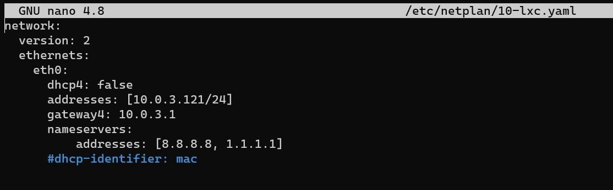
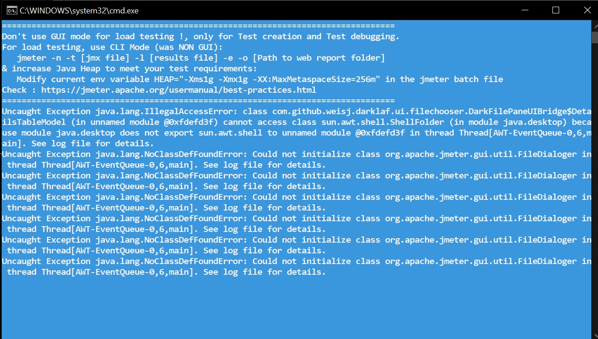

## Laporan Hasil Pratikum Modul 4  - Sistem Administrasi Server 

Nadila Chusnul K - 1202190020 \
Anastasya Rahma Juniarti - 120219058\
Kelompok 10 

## Ubuntu PHP 
1. Siapkan LXC untuk ubuntu7.4\
Clone LXC ubuntu_php7.4 menjadi ubuntu_php7.4_2 dan ubuntu_php7.4_3

    ```bash
    sudo lxc-stop -n ubuntu_php7.4
    sudo lxc-copy -n ubuntu_php7.4 -N ubuntu_php7.4_2 -sKD
    sudo lxc-copy -n ubuntu_php7.4 -N ubuntu_php7.4_3 -sKD
     ```
        
        

2. Start LXC
    ```bash
    sudo lxc-start -n ubuntu_php7.4
    sudo lxc-start -n ubuntu_php7.4_2
    sudo lxc-start -n ubuntu_php7.4_3
    ```
        

    ### Masuk ubuntu php7.4_2 dan kemudian Configurasi IP dan nginx ubuntu_php7.4_2
    ```bash
    sudo lxc-attach -n ubuntu_php7.4_2
    nano /etc/netplan/10-lxc.yaml
    ```
        

    ganti ip menjadi 10.0.3.111
        

     ```bash
    netplan apply
    ip addr show eth0
    ```
    

    Daftarkan domain lxc_php7_2.dev di hosts file
 
    ```bash
     nano /etc/hosts
     ```
    
    Konfigurasi nginx untuk lxc_php7.4_2.dev
     ```bash
    nano /etc/nginx/sites-available/lxc_php7.dev
     ```
    
    

    Check configurasi nginx dan start nginx
    ```bash
     nginx -t
     service nginx restart
     curl -i http://lxc_php7_2.dev
     ```
    
    
    
        kemuduian exit 
    

     ### Masuk ubuntu php7.4_3
    ```bash
     sudo lxc-attach -n ubuntu_php7.4_3
    ```
    

    Configurasi IP dan nginx ubuntu_php7.4_3
      ```bash
     nano /etc/netplan/10-lxc.yaml
     ```
    

    ganti ip menjadi 10.0.3.121
    

    Konfig dan kemudain check Ip 
    ```bash
     netplan apply
    ip addr show eth0
     ```
    

    Daftarkan domain lxc_php7.4_3.dev di hosts file
     ```bash
     nano /etc/hosts
     ```
    
    

    Konfigurasi nginx untuk lxc_php7_3.dev
     ```bash
    nano /etc/nginx/sites-available/lxc_php7.dev
     ```
    
    

    Configurasi nginx dan start nginx dan akses
    
     ```bash
    nginx -t
    service nginx restart
    curl -i http://lxc_php7_3.dev
    ```
    
    

    kemudian exit

    ### Debian PHP

    1. Siapkan LXC untuk debian_php5.6/

        Clone LXC debian_php5.6 menjadi debian_php5.6_2 dan debian_php5.6_3
    ```bash
    sudo lxc-stop -n debian_php5.6
    sudo lxc-copy -n debian_php5.6 -N debian_php5.6_2 -sKD
    sudo lxc-copy -n debian_php5.6 -N debian_php5.6_3 -sKD
     ```

    
    Start LXC
    ```bash
    sudo lxc-start -n debian_php5.6
    sudo lxc-start -n debian_php5.6_2
    sudo lxc-start -n debian_php5.6_3
     ```
    

    Masuk ke lxc debian_php5.6_2
    ```bash
    sudo lxc-attach -n debian_php5.6_2
     ```
    
    Configurasi IP dan nginx debian_php5.6_2
      ```bash
     nano /etc/network/interfaces
     ```
     

     ganti ip menjadi 10.0.3.112
    

      ```bash
     service nerworking restart
     ```
    

    Daftarkan domain lxc_php5_2.dev di hosts file
    ```bash
     nano /etc/hosts
     ```
   
   

    Konfigurasi nginx untuk lxc_php5.6_2.dev


     ```bash 
        nano /etc/nginx/sites-available/lxc_php5.dev
     ```
    
    

    kemudian keluar 

    

    ### Masuk debian_php5.6_3
     ```bash
     sudo lxc-attach -n debian_php5.6_3
    ```
    

    Configurasi IP dan nginx debian_php5.6_3
    ```bash
     nano /etc/network/interfaces
    ```
    
    ganti ip menjadi 10.0.3.122
    

     ```bash
     service networking restart
    ```
    

    Daftarkan domain lxc_php5_3.dev di hosts file
    ```bash
    nano /etc/hosts
    ```
    
    

    Konfigurasi nginx untuk lxc_php5.6_3.dev
    ```bash
    nano /etc/nginx/sites-available/lxc_php5.dev
    ```
    

    kemudian exit 

    

    ### Masuk vm
    
    

    ### Load balancer menggunakan Round robin
    

    Jalankan jmeter. Ganti angka pada box (number of threads) dari menu user access menjadi 50, 100, 150\
    - number of threads 50

    
    
    

    pada step ini terdapat eror :) dengan pesan eror seperti berikut
    
    
    


